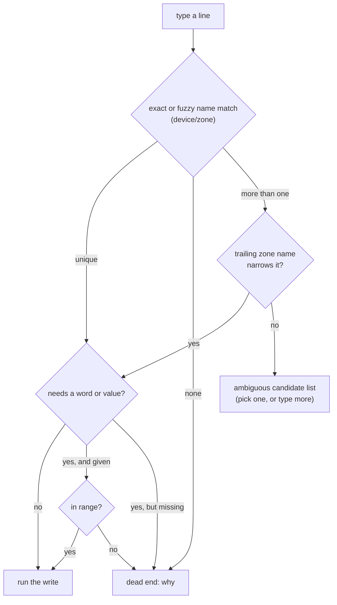

# Uchi

A command-line interface to a Homey Pro smart home: a Node core behind a Unix
socket, with an Omarchy 4 shell plugin as its first UI wrapper.

See [`docs/design.md`](docs/design.md) for the full design — architecture,
protocol, prompt grammar, and panel sections.

## Status

Phases 1–3 of the build order in `docs/design.md` are done: the core owns the
Homey connection, the grammar, and the append-only log; the Omarchy plugin
renders a bar pill and a prompt panel (Recent + Here) wired to real desktop
context. Attention (phase 4) and Habits (phase 5) aren't built yet — `core/`
has no `attention.mjs`, `habits.mjs`, or `model.mjs`.

## How to use it

Click the bar pill to open the panel, or type in the prompt directly. A line
names a device or zone and, if it needs one, a verb or value:

- `desk 40` — dims the Desk Lamp to 40%
- `desk +10` / `desk *2` / `desk ++` — steps, scales, or notches it instead
  of setting an absolute value
- `front door unlock` — unlocks the Front Door
- `office` — lists the Office's devices; pressing **Enter** on this row (panel
  only, not `bin/uchi`) pins it as Here until another room is queried

`↑`/`↓` moves the cursor over a candidate list when a line is ambiguous;
`Enter` runs the highlighted line. Moods, flows, the `kind` grammar
(`light`/`son`/`temp`), and chaining (`,`/`;`) are in `docs/design.md`'s
grammar section as the target design — not implemented yet; phases 1–3 cover
device/zone matching, the four verbs (`on`/`off`/`lock`/`unlock`), and the
absolute/step/scale/notch value forms. The same lines work from a terminal
via `bin/uchi <line>` — see below.

### How a line resolves



`prompt.resolve` runs this on every keystroke (side-effect-free, live
candidates); `prompt.run` runs it once more on **Enter** and, only if it
reaches "run the write", actually performs it. There's no agent fallback
yet — a line that dead-ends just dead-ends (phase 6 in `docs/design.md`'s
build order, not started).

## Running it

`bin/uchi setup` (via `gum`) writes the Homey address and API token to
`~/.local/state/omarchy/settings/uchi.json`, mode `0600`. `Service.qml` spawns
the core and connects over `$XDG_RUNTIME_DIR/uchi.sock`; `bin/uchi <line>`,
`bin/uchi status`, and `bin/uchi rpc <method> [paramsJson]` talk to the same
socket from a terminal. There's no installed `uchi` command yet — everything
runs as `bin/uchi` from a checkout.

### Local development

Quickshell's plugin loader rejects a `bar-widget` entry point reached through
a symlinked plugin folder ("File name case mismatch" — misleading, but that's
what it means; the `service` kind tolerates a symlink, `bar-widget` doesn't).
`make dev-mount` bind-mounts this repo onto
`~/.config/omarchy/plugins/uchi` so the loader sees a real directory while
edits still land here; `make dev-unmount` reverses it. A bind mount doesn't
survive a reboot — re-run `make dev-mount` after one.

After editing QML, use `omarchy-restart-shell` (a full restart) — `omarchy-shell
shell rescanPlugins` doesn't reliably pick up new files or QML changes.

## Testing

```
cd core && node --test
```

`core/test/fixture.mjs` is a deliberately fictional house matching
`docs/design.md`'s own examples — tests never use real household data.

## License

[MIT](LICENSE), except `core/`, which is [GPLv3 or later](core/LICENSE) as of
commit `4d3e7aa` forward (not retroactive — see that file) — the core owns
the Homey connection, grammar, and ranking logic; wrappers (the Omarchy
plugin, a future TUI) stay MIT so anyone can build one without adopting GPL
themselves.
