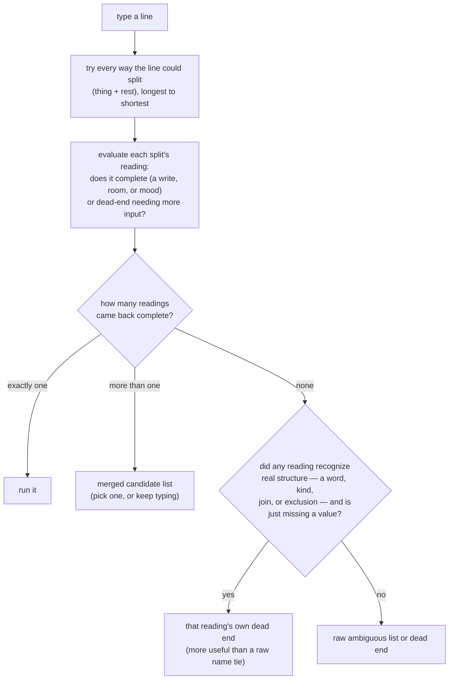

# Uchi

A command-line interface to a Homey Pro smart home: a Node core behind a Unix
socket, with an Omarchy 4 shell plugin as its first UI wrapper.

See [`docs/design.md`](docs/design.md) for the full design — architecture,
protocol, prompt grammar, and panel sections.

## Status

Phases 1–3 of the build order in `docs/design.md` are done: the core owns the
Homey connection, the grammar, and the append-only log; the Omarchy plugin
renders a bar pill and a prompt panel (Recent + Here) wired to real desktop
context. Attention (phase 4) and Habits (phase 5) aren't built yet — `core/`
has no `attention.mjs`, `habits.mjs`, or `model.mjs`.

## How to use it

Click the bar pill to open the panel, or type in the prompt directly. A line
names a device or zone and, if it needs one, a verb or value:

- `desk 40` — dims the Desk Lamp to 40%
- `desk +10` / `desk *2` / `desk ++` — steps, scales, or notches it instead
  of setting an absolute value
- `front door unlock` — unlocks the Front Door
- `office` — lists the Office's devices; pressing **Enter** on this row (panel
  only, not `bin/uchi`) pins it as Here until another room is queried

`↑`/`↓` moves the cursor over a candidate list when a line is ambiguous;
`Enter` runs the highlighted line. The same lines work from a terminal via
`bin/uchi <line>` — see below.

### The full grammar

```
[thing[+thing…]] [!thing[+thing…]] [word] [value] [, segment…]

thing    device name · zone name · mood · flow · kind (son=every Sonos,
         light=every light, temp=every thermostat) · omitted = whole house
word     capability: temp · light · vol
         verb:       off on play pause next grp ungrp lock unlock
value    absolute  40
         step      +10  -10
         scale     *2   /2      (levels only: dim, volume — clamps at 0/100)
         notch     ++   --      (one fixed step per kind, from core config)
chain    , or ;    a segment starting with a word inherits the previous subject
?        lists the words that apply to the current match
```

This is the target design (`docs/design.md`'s full grammar section), and it's almost entirely
built: device/zone matching (exact and fuzzy), `kind` as a bare thing (`light`, `temp` — whole
house, `son` excepted below), `+` joining and `!` exclusion (both fuzzy-matched the same way a
lone zone name is), mood as a thing, chain (`,`/`;`, with subject inheritance), every value form,
the four verbs, `play`/`pause`, the three capability words, and `?` for a single device. Still
missing: `son` (nothing marks a device as Sonos-branded rather than just any speaker), `flow` as a
thing (no fixture/spec to resolve it against yet), `grp`/`ungrp`/`next`, and `?` for a zone (only a
single device's applicable words resolve today).

### How a line resolves



Completeness always outranks exactness — a dead-ending reading never competes with a complete one,
no matter how much more of the input it consumed. `prompt.resolve` runs this on every keystroke
(side-effect-free, live candidates); `prompt.run` runs it once more on **Enter** and, only if it
reaches "run it", actually performs it. There's no agent fallback yet — a line that dead-ends just
dead-ends (phase 6 in `docs/design.md`'s build order, not started).

## Running it

`bin/uchi setup` (via `gum`) writes the Homey address and API token to
`~/.local/state/omarchy/settings/uchi.json`, mode `0600`. `Service.qml` spawns
the core and connects over `$XDG_RUNTIME_DIR/uchi.sock`; `bin/uchi <line>`,
`bin/uchi status`, and `bin/uchi rpc <method> [paramsJson]` talk to the same
socket from a terminal. There's no installed `uchi` command yet — everything
runs as `bin/uchi` from a checkout.

### Local development

`make dev-deploy` copies this repo to `~/.config/omarchy/plugins/uchi` (a real
copy, not a symlink or bind mount — Quickshell's plugin loader rejects a
`bar-widget` entry point reached through either, with a misleading "File name
case mismatch" error). Re-run it after every change you want to test; editing
the repo itself has no effect on the running shell until you do.

The shell watches that plugins directory and reloads on its own after a
deploy that only edited existing files. After a deploy that adds a file or
changes `manifest.json`, use `omarchy-restart-shell` (a full restart) instead
— `omarchy-shell shell rescanPlugins` doesn't reliably pick up either.

## Testing

```
cd core && node --test
```

`core/test/fixture.mjs` is a deliberately fictional house matching
`docs/design.md`'s own examples — tests never use real household data.

## License

[MIT](LICENSE), except `core/`, which is [GPLv3 or later](core/LICENSE) as of
commit `4d3e7aa` forward (not retroactive — see that file) — the core owns
the Homey connection, grammar, and ranking logic; wrappers (the Omarchy
plugin, a future TUI) stay MIT so anyone can build one without adopting GPL
themselves.
